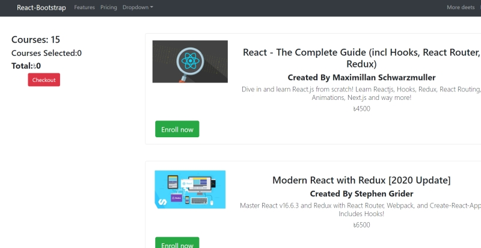

# Course Enrollment

Website Link: [Course Enrollment](https://pedantic-neumann-e61a3b.netlify.app/#features "Course Enrollment")

Built a react SPA app where various courses are displayed in the
page and clicking on each one the total count increases

Environment : Reactjs,contextApi,Javascript, NodeJS,Material-UI

- Users can click on a course to get enrolled.
- Clicking on each couse will add its enrollment fee to total payment chart.
- Users can see how many courses they have enrolled in general and their total fee

To run this app in your editor,clone this project and run the command npm start to start downloading the necessary packages.
